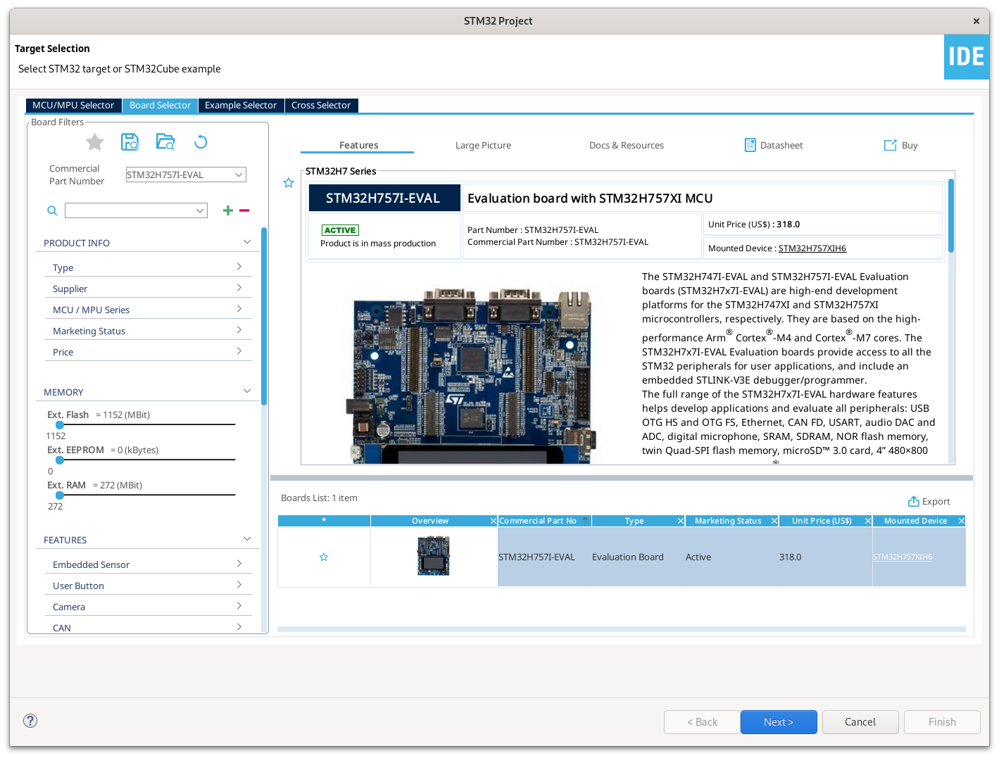
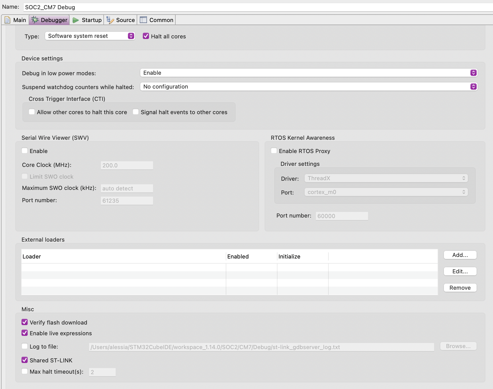
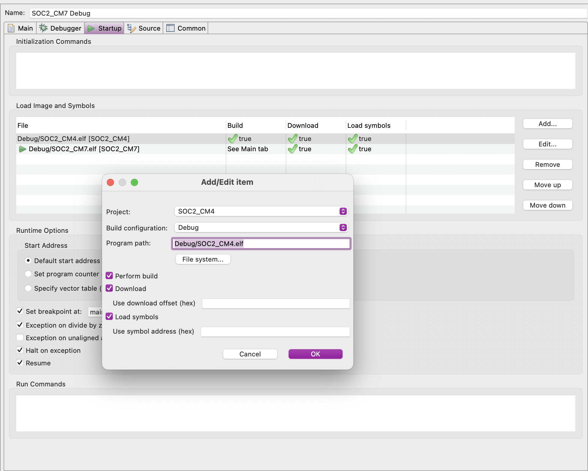
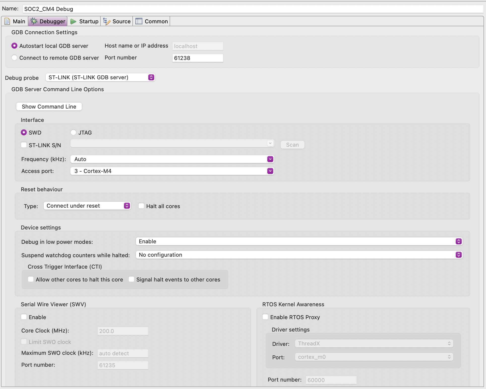
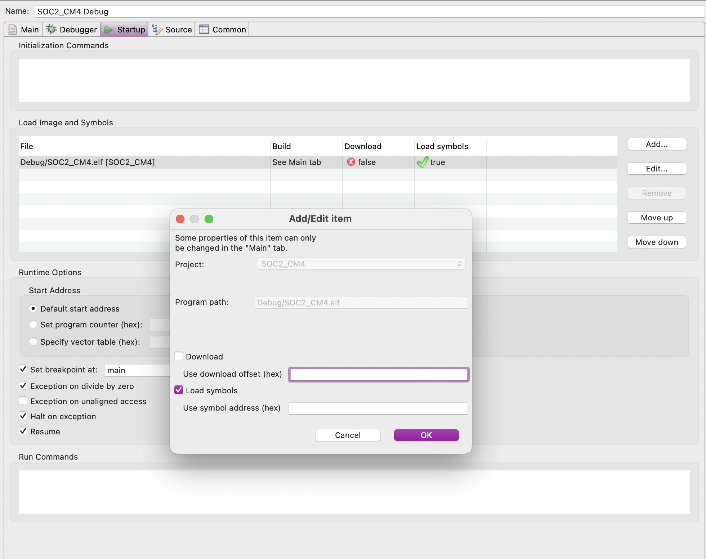

<div id="top"></div>

<!-- PROJECT SHIELDS -->
<!--
*** I'm using markdown "reference style" links for readability.
*** Reference links are enclosed in brackets [ ] instead of parentheses ( ).
*** See the bottom of this document for the declaration of the reference variables
*** for contributors-url, forks-url, etc. This is an optional, concise syntax you may use.
*** https://www.markdownguide.org/basic-syntax/#reference-style-links
-->
[![Contributors][contributors-shield]][contributors-url]
[![Forks][forks-shield]][forks-url]
[![Stargazers][stars-shield]][stars-url]
[![Issues][issues-shield]][issues-url]
[![MIT License][license-shield]][license-url]
<!-- [![LinkedIn][linkedin-shield]][linkedin-url] -->

<!-- PROJECT LOGO -->
<br />
<div align="center">
  <a href="https://github.com/alessia30/IPC-on-H7">
    
  </a>

<h3 align="center">Data acquisition and encryption using multi-core STM32H7 architecture</h3>

  <p align="center">
    The project consists of the design of an application that involves several peripherals of the STM32H757I-EVAL development board, a high-performance multi-core system, and the interconnection between the two on-chip cores.
    <br />
    <a href="https://github.com/alessia30/IPC-on-H7/tree/main/docs"><strong>Explore the docs »</strong></a>
    <br />
    <br />
    <!-- <a href="https://github.com/alessia30/IPC-on-H77">View Demo</a>
    · -->
    <a href="https://github.com/alessia30/IPC-on-H7/issues">Report Bug</a>
    ·
    <a href="https://github.com/alessia30/IPC-on-H7/issues">Request Feature</a>
  </p>
</div>

<!-- TABLE OF CONTENTS -->
<details>
  <summary>Table of Contents</summary>
  <ol>
    <li>
      <a href="#about-the-project">About The Project</a>
      <ul>
        <li><a href="#built-with">Built With</a></li>
      </ul>
    </li>
    <li>
      <a href="#getting-started">Getting Started</a>
      <ul>
        <li><a href="#prerequisites">Prerequisites</a></li>
        <li><a href="#installation">Installation</a></li>
      </ul>
    </li>
    <li><a href="#usage">Usage</a></li>
    <li><a href="#roadmap">Roadmap</a></li>
    <li><a href="#contributing">Contributing</a></li>
    <li><a href="#license">License</a></li>
    <li><a href="#contact">Contact</a></li>
    <li><a href="#acknowledgments">Acknowledgments</a></li>
  </ol>
</details>

<!-- ABOUT THE PROJECT -->
## About The Project

[![Product Name Screen Shot][product-screenshot]]()

<p align="right">(<a href="#top">back to top</a>)</p>

### Built With

* [CubeIDE](https://www.st.com/en/development-tools/stm32cubeide.html)
* [CubeMX](https://www.st.com/content/st_com/en/stm32cubemx.html)
* [Stm32H7 HAL driver](https://github.com/STMicroelectronics/stm32h7xx_hal_driver)

<p align="right">(<a href="#top">back to top</a>)</p>

### Functional Specification

The application uses the M4 core to acquire a stream of data from the ADC peripheral (which reads the analog signal from the integrated potentiometer), sends it to the other core (M7) with the OpenAMP protocol, performs encryption on the data, and then outputs the result through the UART, exploiting OpenAMP for core synchronization. The M7 and M4 cores can work in parallel.

<!-- GETTING STARTED -->
## Getting Started

This project has been developed with the help and assistance of STM32 software developer tools, in particular CubeMX for the creation of the base code through the GUI editor of the .ioc file and CubeIDE for code and library management, as well as debugging options. The code can be launched and debugged through the ST-Link USB cable and the IDE. The UART output can be seen with any serial client on the same USB port as the ST-Link.

### Prerequisites

Software tools:

* CubeIDE
* CubeMX
* Serial communication program (such as PuTTY/Minicom)

### Installation

1. Clone the repo
   ```sh
   git clone https://github.com/alessia30/IPC-on-H7.git
   ```
2. Create a new blank STM32 project
3. Select the board STM32H757I-EVAL


4. Copy the cloned repo's src content into the just created local project folder

<p align="right">(<a href="#top">back to top</a>)</p>

<!-- USAGE EXAMPLES -->
## Usage

In order to run and debug the project, the 2 cores need to be configured so that the M7 loads the whole code into the memory and wakes up the M4.

To create a new debug configuration, first open the project and select the main.c in the M7 core; then go to Debug -> Debug Configurations -> STM32 C/C++ Application and click on the "New Configuration" button: a new configuration for the M7 core called "\<Project\>_CM7 Debug" should have been created. 

In the Debugger tab: 
  - Reset behaviour: select "Halt all cores"
  - Misc: select "Shared ST-LINK"



In the Startup tab: 
- Load Image and Symbols: select "Add" and then add the M4 core project. Make sure "Download" is checked.
  The start symbol should be on the M7 configuration: move the configurations if needed. 


Apply and close. Repeat the same for the M4 core, with the following differences: 
- in the Debugger tab change the port number to a different port than the M7 core (eg. 61238) and make sure "Halt all cores" is unchecked

  
- in the Startup tab select the M4 configuration and press "Edit": then uncheck "Download".
 

This debug configuration can also be used to run the program: now both cores will start by launching the M7 debug/run.

The output can be seen using any serial client tool.

<p align="right">(<a href="#top">back to top</a>)</p>

<!-- ROADMAP -->
## Roadmap

- [] Implement interrupt based on timer conversion for the ADC to regulate scan frequency (slower)
- [] Implement lock (hardware/software) mechanism as an alternative to mailbox/OpenAMP to increase potential concurrent execution

See the [open issues](https://github.com/alessia30/IPC-on-H7/issues) for a full list of proposed features (and known issues).

<p align="right">(<a href="#top">back to top</a>)</p>


